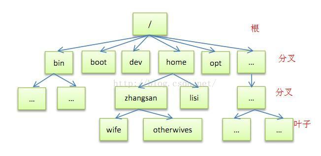

# [原文地址](https://www.cnblogs.com/zhuchenglin/p/8686924.html)

## Linux各目录及每个目录的详细介绍

:::details

|目录|描述|
|----|----|
|/bin |存放二进制可执行文件(ls,cat,mkdir等)，常用命令一般都在这里。|
|/etc |存放系统管理和配置文件|
|/home |存放所有用户文件的根目录，是用户主目录的基点，比如用户user的主目录就是/home/user，可以用~user表示|
|/opt| 额外安装的可选应用程序包所放置的位置。一般情况下，我们可以把tomcat等都安装到这里。|
|/proc| 虚拟文件系统目录，是系统内存的映射。可直接访问这个目录来获取系统信息。|
|/root| 超级用户（系统管理员）的主目录（特权阶级^o^）|
|/sbin| 存放二进制可执行文件，只有root才能访问。这里存放的是系统管理员使用的系统级别的管理命令和程序。如ifconfig等。|
|/dev |用于存放设备文件。|
|/mnt| 系统管理员安装临时文件系统的安装点，系统提供这个目录是让用户临时挂载其他的文件系统。|
|/boot| 存放用于系统引导时使用的各种文件|
|/lib |存放跟文件系统中的程序运行所需要的共享库及内核模块。共享库又叫动态链接共享库，作用类似windows里的.dll文件，存放了根文件系统程序运行所需的共享文件。|
|/tmp| 用于存放各种临时文件，是公用的临时文件存储点。|
|/var| 用于存放运行时需要改变数据的文件，也是某些大文件的溢出区，比方说各种服务的日志文件（系统启动日志等。）等。|
|/lost+found| 这个目录平时是空的，系统非正常关机而留下“无家可归”的文件（windows下叫什么.chk）就在这里。|
|/usr |用于存放系统应用程序，比较重要的目录/usr/local 本地系统管理员软件安装目录（安装系统级的应用）。这是最庞大的目录，要用到的应用程序和文件几乎都在这个目录。|
|/usr|/x11r6 存放x window的目录|
|/usr/bin| 众多的应用程序|
|/usr/sbin |超级用户的一些管理程序|
|/usr/doc |linux文档|
|/usr/include |linux下开发和编译应用程序所需要的头文件|
|/usr/lib| 常用的动态链接库和软件包的配置文件|
|/usr/man |帮助文档|
|/usr/src |源代码，linux内核的源代码就放在/usr/src/linux里|
|/usr/local/bin| 本地增加的命令|
|/usr/local/lib |本地增加的库|

:::

## /proc 虚拟文件系统目录

:::details

|目录|描述|
|---|---|
|/proc/x|关于进程x的信息目录，这一x是这一进程的标识号。每个进程在/proc 下有一个名为自己进程号的目录。|
|/proc/cpuinfo|存放处理器( c p u )的信息，如c p u的类型、制造商、型号和性能等。|
|/proc/devices|当前运行的核心配置的设备驱动的列表。|
|/proc/dma|显示当前使用的d m a通道。|
|/proc/filesystems|核心配置的文件系统信息。|
|/proc/interrupts|显示被占用的中断信息和占用者的信息，以及被占用的数量。|
|/proc/ioports|当前使用的i / o端口。|
|/proc/kcore|系统物理内存映像。与物理内存大小完全一样，然而实际上没有占用这么多内存；它仅仅是在程序访问它时才被创建。(注意：除非你把它拷贝到什么地方，否则/proc 下没有任何东西占用任何磁盘空间。)|
|/proc/kmsg|核心输出的消息。也会被送到s y s l o g。|
|/proc/ksyms|核心符号表。|
|/proc/loadavg|系统“平均负载”； 3个没有意义的指示器指出系统当前的工作量。|
|/proc/meminfo|各种存储器使用信息，包括物理内存和交换分区( s w a p )。|
|/proc/modules|存放当前加载了哪些核心模块信息。|
|/proc/net|网络协议状态信息。|
|/proc/self|存放到查看/proc 的程序的进程目录的符号连接。当2个进程查看/proc 时，这将会是不同的连接。这主要便于程序得到它自己的进程目录。|
|/proc/stat|系统的不同状态，例如，系统启动后页面发生错误的次数。|
|/proc/uptime|系统启动的时间长度。|
|/proc/version|核心版本|

:::

## /var 存放运行时需要改变数据的文件

:::details

|目录|描述|
|----|----|
|/var/catman|包括了格式化过的帮助( m a n )页。|
|/var/lib|存放系统正常运行时要改变的文件。|
|/var/local|存放/usr/local 中安装的程序的可变数据(即系统管理员安装的程序)。注意，如果必要，即使本地安装的程序也会使用其他/var 目录，例如/var/lock 。|
|/var/lock|锁定文件。许多程序遵循在/var/lock 中产生一个锁定文件的约定，以用来支持他们正在使用某个特定的设备或文件。其他程序注意到这个锁定文件时，就不会再使用这个设备或文件。|
|/var/log|各种程序的日志( l o g )文件，尤其是login (/var/log/wtmp log纪录所有到系统的登录和注销) 和syslog (/var/log/messages 纪录存储所有核心和系统程序信息)。/var/log里的文件经常不确定地增长，应该定期清除。|
|/var/run|保存在下一次系统引导前有效的关于系统的信息文件。例如， /var/run/utmp 包含当前登录的用户的信息。|
|/var/spool|放置“假脱机( s p o o l )”程序的目录，如m a i l、n e w s、打印队列和其他队列工作的目录。每个不同的s p o o l在/var/spool 下有自己的子目录，例如，用户的邮箱就存放在/var/spool/mail中。|
|/var/tmp|比/tmp 允许更大的或需要存在较长时间的临时文件。注意系统管理员可能不允许/var/tmp 有很旧的文件。|

:::

## /usr 用于存放系统应用程序

:::details

|目录|描述|
|----|----|
|/usr/x11r6|包含x wi n d o w系统的所有可执行程序、配置文件和支持文件。为简化x的开发和安装，x的文件没有集成到系统中。x wi n d o w系统是一个功能强大的图形环境，提供了大量的图形工具程序。用户如果对microsoft wi n d o w s或m a c h i n t o s h比较熟悉的话，就不会对x win d o w系统感到束手无策了。|
|/usr/x386|类似/ u s r / x 11r6 ，但是是专门给x 11 release 5的。|
|/usr/bin|集中了几乎所有用户命令，是系统的软件库。另有些命令在/bin 或/usr/local/bin 中。|
|/usr/sbin|包括了根文件系统不必要的系统管理命令，例如多数服务程序。|
|/usr/man|这些目录包含所有手册页|
|/usr/info|这些目录包含所有手册页|
|/usr/doc|这些目录包含所有手册页|
|/usr/include|包含了c语言的头文件，这些文件多以. h结尾，用来描述c语言程序中用到的数据结构、子过程和常量。为了保持一致性，这实际上应该放在/usr/lib 下，但习惯上一直沿用了这个名字。|
|/usr/lib|包含了程序或子系统的不变的数据文件，包括一些s i t e - w i d e配置文件。名字l i b来源于库(library); 编程的原始库也存在/usr/lib 里。当编译程序时，程序便会和其中的库进行连接。也有许多程序把配置文件存入其中。|
|/usr/local|本地安装的软件和其他文件放在这里。这与/ u s r很相似。用户可能会在这发现一些比较大的软件包，如t e x、e m a c s等。|

:::

## /dev 用于存放设备文件

:::details

|目录|描述|
|----|----|
|/dev/console|系统控制台，也就是直接和系统连接的监视器。|
|/dev/hd|ide硬盘驱动程序接口。如：/dev/hda指的是第一个硬盘，had1则是指/dev/hda的第一个分区。如系统中有其他的硬盘，则依次为/dev/hdb、/dev/hdc、……；如有多个分区则依次为hda1、hda2……|
|/dev/sd|scsi磁盘驱动程序接口。如有系统有scsi硬盘，就不会访问/dev/had，而会访问/dev/sda。|
|/dev/fd|软驱设备驱动程序。如：/dev/fd0指系统的第一个软盘，也就是通常所说的a：盘，/dev/fd1指第二个软盘，……而/dev/fd1h1440则表示访问驱动器1中的4.5高密盘。|
|/dev/st|scsi磁带驱动器驱动程序。|
|/dev/tty|提供虚拟控制台支持。如：/dev/tty1指的是系统的第一个虚拟控制台，/dev/tty2则是系统的第二个虚拟控制台。|
|/dev/pty|提供远程登陆伪终端支持。在进行te l n e t登录时就要用到/ d e v / p t y设备。|
|/dev/ttys|计算机串行接口，对于d o s来说就是“ c o m 1”口。|
|/dev/cua|计算机串行接口，与调制解调器一起使用的设备。|
|/dev/null|“黑洞”，所有写入该设备的信息都将消失。例如：当想要将屏幕上的输出信息隐藏起来时，只要将输出信息输入到/ d e v / n u l l中即可。|

:::

## /etc 存放系统管理和配置文件

:::details

|目录|描述|
|----|----|
|/etc/rc或/etc/rc.d或/etc/rc?.d|启动、或改变运行级时运行的脚本或脚本的目录。|
|/etc/passwd|用户数据库，其中的域给出了用户名、真实姓名、用户起始目录、加密口令和用户的其他信息。|
|/etc/fdprm|软盘参数表，用以说明不同的软盘格式。可用setfdprm 进行设置。更多的信息见set fdprm的帮助页。|
|/etc/fstab|指定启动时需要自动安装的文件系统列表。也包括用swapon -a启用的swap区的信息。|
|/etc/group|类似 /etc/passwd ，但说明的不是用户信息而是组的信息。包括组的各种数据。|
|/etc/inittab|init 的配置文件。|
|/etc/issue|包括用户在登录提示符前的输出信息。通常包括系统的一段短说明或欢迎信息。具体内容由系统管理员确定。|
|/etc/magic|“f i l e”的配置文件。包含不同文件格式的说明，“file”基于它猜测文件类型。|
|/etc/motd|motd是message of the day的缩写，用户成功登录后自动输出。内容由系统管理员确定。常用于通告信息，如计划关机时间的警告等。|
|/etc/mtab|当前安装的文件系统列表。由脚本(script)初始化，并由mount 命令自动更新。当需要一个当前安装的文件系统的列表时使用(例如df命令)。|
|/etc/shadow|在安装了影子(shadow)口令软件的系统上的影子口令文件。影子口令文件将/etc/passwd文件中的加密口令移动到/etc/shadow中，而后者只对超级用户(root)可读。这使破译口令更困难，以此增加系统的安全性。|
|/etc/login.defs|login命令的配置文件。|
|/etc/printcap|类似/etc/termcap ，但针对打印机。语法不同。|
|/etc/profile、/etc/csh.login、/etc/csh.cshrc|登录或启动时bourne或c shells执行的文件。这允许系统管理员为所有用户建立全局缺省环境。|
|/etc/securetty|确认安全终端，即哪个终端允许超级用户(root)登录。一般只列出虚拟控制台，这样就不可能(至少很困难)通过调制解调器(modem)或网络闯入系统并得到超级用户特权。|
|/etc/shells|列出可以使用的shell。chsh 命令允许用户在本文件指定范围内改变登录的shell。提供一台机器ftp服务的服务进程ftpd 检查用户shell是否列在/etc/shells 文件中，如果不是，将不允许该用户登录。|
|/etc/termcap|终端性能数据库。说明不同的终端用什么“转义序列”控制。写程序时不直接输出转义序列(这样只能工作于特定品牌的终端)，而是从/etc/termcap 中查找要做的工作的正确序列。这样，多数的程序可以在多数终端上运行。|

:::
